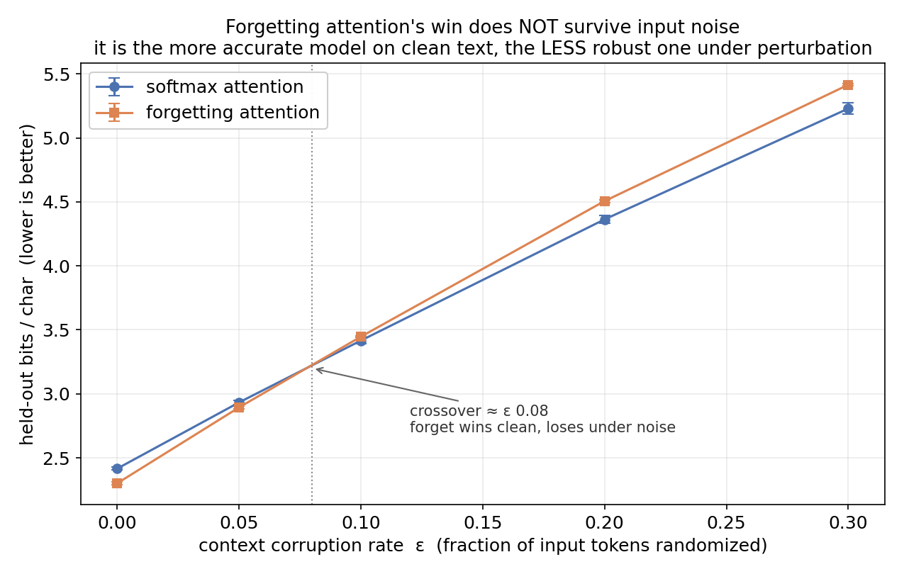

# ibnn-forget-lm

Does the **IBNN neuron** (an implicit-bias lateral-coupling FFN) add anything on top of a
**forget gate in attention** — and what happens when you combine them? A small, fully-local,
controlled char-LM harness to find out.

This continues the investigation in [ibnn-lm](https://github.com/DanielTea/ibnn-lm), which
established two things at character-LM scale (with verified-correct implementations):

1. **Swapping the FFN neuron to IBNN does not help.** Across data-efficiency, tuning, the full
   implicit solve, a 13× scale-up, and a learned (non–mean-field) coupling, IBNN ties — or with
   extra parameters, loses to — a standard Transformer FFN.
2. **A forget gate in attention helps a lot.** Adding a content-gated multiplicative decay to
   softmax attention beat plain attention by **0.19–0.25 bits/char** at matched parameters. That
   mechanism is **not novel** — it is an independent re-derivation of the **Forgetting
   Transformer (FoX)**, Lin, He, Nikishin & Courville, ICLR 2025
   ([arXiv:2503.02130](https://arxiv.org/abs/2503.02130)) — a "learnable, data-dependent ALiBi."

The diagnosis was *structural*: a learnable-decay coupling is wasted on the FFN's **unordered
channels** but pays off on the **structured token axis** (attention's domain). This repo puts
both knobs in one model and runs the clean factorial.

## The experiment

A 2×2, identical everything except the two layers under test:

|            | softmax attention | forgetting attention |
|------------|-------------------|----------------------|
| **SM FFN**   | the plain Transformer | the FoX-style win |
| **IBNN FFN** | the IBNN study's tie  | **the open question** |

The question of interest is the bottom-right cell vs `sm+forget`: **once the forget gate is
doing the heavy lifting, does the IBNN neuron contribute anything?** Prior is "no" (IBNN tied
everywhere), but the forget gate changes the attention dynamics, so it's worth a direct test.

## Quick start (fully local, MPS/CUDA/CPU)

```bash
./setup.sh            # venv + torch (uses uv if available)
make sanity           # correctness checks (incl. λ=0 ≡ SM, forget ⊇ softmax)
make combo            # the 2×2 factorial, 3 seeds  (tinyshakespeare)
make combo-enwik8     # the same at larger scale on enwik8 byte-level
```

Train / generate a single combined model directly:

```bash
python -m ibnn_lm.train --dataset tinyshakespeare --ffn ibnn --attn forget --steps 2500 \
  --out checkpoints/ibnn_forget.pt
python -m ibnn_lm.generate --ckpt checkpoints/ibnn_forget.pt --prompt "ROMEO:" --stream
```

## Results

### The 2×2 factorial (`make combo`, tinyshakespeare, 3 seeds)

Exact held-out **bits-per-char** (lower is better):

|              | softmax attention | forgetting attention | forget effect |
|--------------|-------------------|----------------------|---------------|
| **SM FFN**   | 2.5245 ± 0.018    | **2.3357 ± 0.007**   | **−0.189**    |
| **IBNN FFN** | 2.5432 ± 0.013    | 2.3567 ± 0.017       | −0.187        |
| _IBNN effect_| _+0.019_          | _+0.021_             |               |

**The verdict is clean and a little brutal for IBNN:**
- **Forget gate = the entire win** (−0.19 bpc, essentially identical on both FFN rows).
- **IBNN ≈ 0** — in fact +0.02 bpc (slightly *worse*), within noise, under *both* attention types.
- **No interaction.** The effects are independent; IBNN adds nothing on top of the forget gate.

So combining them doesn't rescue IBNN: the best model is plain **`sm + forget`**. The lateral
neuron is null regardless of the attention it's paired with — consistent with the parent study's
finding that competition over the FFN's *unordered* channels has nothing to exploit.

### New IBNN-FFN ideas (`make ideas`, tinyshakespeare, 3 seeds; smaller `d_ff=192`)

Exact held-out **bits-per-char** (lower is better):

| variant | params | BPC | Δ vs sm | verdict |
|---|---|---|---|---|
| sm (baseline) | 0.373M | 2.624 ± 0.038 | — | — |
| ibnn_meanfield | 0.373M | 2.619 ± 0.035 | −0.006 | tie |
| **#1 ibnn_gate** | 0.373M | 2.626 ± 0.010 | +0.002 | tie |
| **#2 ibnn_topo** | 0.375M | 2.650 ± 0.030 | +0.026 | tie / worst mean |
| **#3 ibnn_sharpen** (2 seeds) | 0.373M | 2.641 | +0.016 | tie / slightly worse |

**None of the three new ideas beats the standard FFN.** As honestly forecast, the FFN-channel
null holds. Notes worth keeping:
- **#1 gate** lands exactly on `sm` (+0.002) but with **much lower variance** (±0.010 vs ±0.038)
  — the competition gate *stabilizes* training without improving the mean.
- **#2 topo** has the **worst mean** (+0.026) — giving the channels a learned geometry *hurt*,
  echoing the earlier full-`D×D` learned-coupling result: extra structure/params on the unordered
  FFN channels backfire rather than help.
- **#3 sharpen** (λ>0) is a tie / marginally worse.

Across now **five** forms of FFN-channel coupling (mean-field, learned-`D×D`, learned-topology,
gate, sharpen) the verdict is unanimous: **competition over a Transformer FFN's unordered
channels is a dead end.** The structured token axis (attention's forget gate) remains the only
place a learnable-decay mechanism earns its keep here.

## Can IBNN be fixed? (new ideas, not in the literature)

The diagnosis says a fix must either give the channels *structure*, change competition from
*smoothing* to something useful, or move it to a meaningful axis. Three variants implemented here
(`ibnn_lm/ideas_test.py`, `make ideas`), each adding <1% params:

- **#1 `ibnn_gate` — competition-as-gate.** Instead of an additive nudge `z = y − λL`, use the
  lateral signal as a multiplicative gate: `v = φ(y) · 2σ(λL)`. Rides the one FFN trick that
  *does* help Transformers (GLU/SwiGLU); `λ=0` is bit-identical to a standard FFN.
- **#2 `ibnn_topo` — learned channel topology.** Give each hidden channel a learned coordinate
  `eᵢ`; set `w_ik = softmax(−‖eᵢ−e_k‖²/τ)`. The unordered channels self-organize into a learned
  geometry and the coupling becomes *local in that space* — the structured locality the CNN
  version exploits, but learned. A constrained middle-ground between mean-field and the (failed)
  full `D×D` learned coupling.
- **#3 `ibnn_sharpen` — sharpen, don't smooth.** The paper only uses `λ≤0` (homogenizing). With
  the lite layer there's no fixed point to destabilize, so flip to `λ>0`: soft winner-take-all
  that *sparsifies* activations instead of averaging them.

Honest prior: FFN-channel tricks have tied or lost in 8+ prior runs, so these are quick
falsification probes, not confident bets.

## Does the forget-gate win survive robustness & anti-memorization? (`make robustness`)

The IBNN paper's *actual* headline claims are **robustness to perturbation** and **resisting
memorization**, not raw accuracy — and nobody (the IBNN paper *or* the Forgetting Transformer)
checked forgetting attention on those. So we did, softmax vs forgetting attention, matched.



**(1) Robustness to context noise** — eval BPC when a fraction ε of *context* tokens are randomly
corrupted (targets kept clean), 3 seeds:

| ε | softmax | forgetting |
|---|---------|------------|
| 0.00 (clean) | 2.416 ± 0.010 | **2.301 ± 0.010** |
| 0.05 | 2.933 | **2.894** |
| 0.10 | **3.417** | 3.447 |
| 0.20 | **4.364** | 4.507 |
| 0.30 | **5.229** | 5.415 |

The forgetting model wins on clean text but **degrades faster under noise** — the advantage
reverses at **ε ≈ 0.08**, and by ε = 0.20 softmax is ahead by 0.14 bpc (far beyond seed noise).
Mechanistically clean: the forget gate's recency bias makes the model lean on recent tokens, so
corrupting them hurts more; softmax spreads attention and averages out localized noise.

**(2) Memorization** — generalization gap (val BPC − train BPC; smaller = less memorization):
softmax **+0.249 ± 0.006**, forgetting **+0.269 ± 0.013**. The forget gate memorizes *slightly
more*, not less — so it does **not** exhibit the anti-memorization property the IBNN paper prized.

**Takeaway (new, not in the literature):** forgetting attention (FoX) buys clean-data accuracy at
the cost of **robustness** — it is the more accurate model on clean text but the *less* robust one
under input perturbation, and it doesn't memorize less. The clean-BPC headline hides a fragility
trade-off that the robustness/anti-memorization lens exposes.

## Bonus: a real Vision-Language Model, with IBNN (`make vlm`)

Can this setup train a VLM, and does IBNN — which failed on *text* — do any better on **images**,
the domain it was actually designed for? We built a small from-scratch VLM on **Fashion-MNIST**
(a real dataset, and one of the IBNN paper's own benchmarks): a ViT vision encoder + projector +
this repo's GPT decoder. The IBNN neuron is used in the FFNs of **both** the encoder and decoder.

```
image --[ViT encoder]--> visual tokens --[project]--> prefix
prefix + "a photo of a " --[GPT decoder]--> "a photo of a {class}."
```

**It works** — trained from scratch it reaches ~74% test accuracy and captions held-out images
(`true=trouser → "a photo of a trouser."`), erring only on visually-confusable classes
(boot↔sneaker, coat↔pullover). The model genuinely reads the image and writes what it sees.

**Does IBNN help on images?** No — it ties, 3 seeds:

| FFN neuron | Fashion-MNIST VLM accuracy |
|---|---|
| standard FFN | 74.27% ± 2.05 |
| IBNN FFN | 74.12% ± 1.18 |

(A tempting single-seed run showed IBNN +2.6%, but it was **seed noise** — a fresh SM seed hit
76.3%.) This is consistent rather than surprising: the IBNN coupling runs over the FFN's
**unordered channels** in *both* text and images — an image's spatial structure lives in the
conv/patch axis, not the FFN channels — so the "no structure to exploit" null holds across
modalities. The paper's CNN gains come from *spatial* coupling, which this FFN port never had.

Run it: `python -m ibnn_lm.vlm --ffn ibnn --steps 800` (note: IBNN's O(d_ff²) term triggers a
slow one-time MPS kernel compile on first run; the SM path is instant).

**Putting IBNN where it works — a conv encoder with spatial coupling.** The ViT encoder above
couples IBNN over unordered channels. The principled fix is a **convolutional** vision encoder
(`--encoder conv`) whose convs use the paper's **spatial** coupling (`--enc_coupling ibnn`) — IBNN
on a structured axis, inside the VLM. Holding the decoder fixed to isolate the encoder (4 seeds):

| train data | standard conv encoder | spatial-IBNN conv encoder | Δ |
|---|---|---|---|
| 100% | 81.9 ± 1.8 | 81.7 ± 2.2 | −0.3 (tie) |
| 5% | 80.2 ± 1.6 | 80.5 ± **0.6** | +0.3 (tie, lower variance) |

Same honest verdict as the standalone CNN: spatial IBNN **ties in mean, with a small stability
gain** (±0.6 vs ±1.6 at low data) — never worse, not clearly better. (A conv encoder also beats
the tiny ViT encoder outright, ~82% vs ~74% — but that's a backbone choice, not an IBNN effect.)

## The real test: replicate the paper's SPATIAL coupling (`make cnn`)

Every IBNN experiment above ported the neuron into an **FFN**, where the coupling runs over
*unordered channels* — and always tied/lost. The paper's actual win comes from a **spatial
cross-difference convolution**: coupling over a pixel's *spatial neighbours*, which are ordered
and local. So we replicated that faithfully (`ibnn_lm/ibnn_cnn.py`) — a within-channel 3×3
lateral term `L_i = (1/8)·Σ_{k∈N(i)} tanh(p·(z_k − z_i))` inside a small CNN — and compared to a
standard CNN on Fashion-MNIST, including the paper's headline **data-efficiency** regime. (This
coupling is `O(8)` per pixel, far cheaper than the FFN port's `O(d_ff²)`; `λ=0` is bit-identical
to a plain conv, so it's a clean +1-scalar-per-conv superset.)

Test accuracy (higher better):

| train data | standard CNN | spatial-IBNN CNN | Δ | n seeds |
|---|---|---|---|---|
| 100% | 84.2 ± 2.9 | 83.7 ± 5.4 | −0.5 (tie) | 3 |
| 5% | 78.0 ± 3.9 | 81.4 ± 3.2 | **+3.3** | 6 |
| 2% | 81.4 ± 0.7 | 81.8 ± 0.4 | +0.4 | 6 |

**Honest verdict: a slight, directionally-positive but within-noise edge at low data — not the
clean win an early 3-seed run teased (+6.1%, since regressed to +3.3% with 6 seeds; the first run
was inflated by one unlucky standard-CNN seed).** Still, this is the *most IBNN-favourable* signal
in the whole investigation: with **spatial** coupling on **images** in the **scarce-data** regime,
IBNN is never worse and slightly better — directionally consistent with the paper — whereas the
FFN port on text was flat or *worse*. That qualitative difference (spatial ≥ standard; channel
≤ standard) is the cleanest support for the running diagnosis: **the IBNN neuron needs a
structured axis to couple over.** A rigorous claim of the data-efficiency benefit would need a
more careful replication than a laptop 3-conv net at this noise level can provide.

### The paper's HEADLINE claim: adversarial robustness (`make adv`)

The IBNN paper led with **adversarial robustness**, not clean accuracy — so we tested that
faithfully: a **deeper** 5-conv CNN with the spatial `IBNNConv2d` vs the identical CNN with plain
convs, under **FGSM and PGD** attacks, over **8 seeds** (`ibnn_lm/adv_robustness.py`).

| attack | standard CNN | spatial-IBNN CNN | Δ |
|---|---|---|---|
| clean | 90.98 ± 0.74 | 90.94 ± 0.60 | −0.04 |
| FGSM ε=0.1 | 7.41 ± 1.67 | 7.44 ± 3.20 | +0.03 |
| FGSM ε=0.2 | 3.84 ± 2.32 | 4.89 ± 1.91 | +1.05 |
| PGD ε=0.1 | 0.03 ± 0.09 | 0.00 ± 0.00 | ≈0 |

With the **lite** layer (`num_iters=1`) the spatial coupling provides **no** adversarial
robustness — both CNNs collapse identically (FGSM → ~7%, PGD → ~0%).

The **full implicit solve (`num_iters=3`)** at first *looked* like a win — a beyond-noise FGSM gap
(FGSM ε=0.2: IBNN 8.2 ± 1.4 vs standard 4.0 ± 2.2, replicated over 9 seeds). **But it is GRADIENT
MASKING, not robustness** — and FGSM-helps-but-PGD-doesn't is the textbook signature (Athalye,
Carlini & Wagner 2018). A transfer-attack check (clean eval mode) settles it:

| IBNN-`n3` | clean | own FGSM ε=0.2 | transfer (std→IBNN) | PGD-10 | PGD-20 |
|---|---|---|---|---|---|
| | ~91 | ~7–9 | ~6–9 (≈ its own FGSM) | **0.0** | **0.0** |

PGD drives it to **0%**, and standard-crafted adversarials transfer to it just as well as its own —
i.e. the IBNN model is **exactly as fragile as the standard CNN**; the implicit solve merely makes
the *one-step gradient* less useful to the attacker (obfuscation), inflating the FGSM number. So
the paper's headline adversarial-robustness claim **does not reproduce** here: no real robustness,
lite or implicit. (Lesson logged: always check FGSM gains with PGD + a transfer attack.)

### Both mechanisms under one roof: VLM image-corruption robustness (`make vlm-robust`)

A plain CNN has no attention, so the forget gate can't live there — the only place to test
**both** mechanisms under a robustness lens is the VLM (vision encoder + token decoder). A
multi-agent design panel hardened this (`ibnn_lm/vlm_robust.py`): it found and fixed a real bug
(a forget gate in a VLM *forgets the visual prefix* and the cell collapses — fixed via fgate-bias
init), pre-registered **one** inferential test on **retention** (acc_corrupt/acc_clean, paired by
seed, to remove the clean-level confound), and logged λ-engagement to avoid the inert-coupling
trap. Factorial: `{encoder: standard vs spatial-IBNN conv (num_iters=3)} × {decoder: softmax vs
forget}`, 8 seeds, all cells clean-matched (~82–83%), λ engaged (~0.09), zero collapses.

Retention (acc under corruption / clean acc, %, 8 seeds):

| cell | gauss σ=0.2 | blur σ=1.2 (H1) | FGSM ε=0.2 | PGD |
|---|---|---|---|---|
| standard / softmax | 51 | 74 | 23 | 3 |
| **IBNN / softmax** | **66** | 75 | 19 | 5 |
| standard / forget | 51 | 73 | 18 | 2 |
| **IBNN / forget** | **68** | 75 | 14 | 4 |

- **Pre-registered primary (blur retention, IBNN vs standard encoder): NULL** — Δ +1.5%, bootstrap
  95% CI [−0.7, +3.6] (includes 0).
- **Exploratory but clean and consistent:** the spatial-IBNN encoder gives a **+15–17% retention
  gain under additive Gaussian noise** (σ=0.2), on *both* decoder rows — mechanistically sensible
  (the lateral coupling is a low-pass that cancels high-frequency additive noise). Not the
  pre-registered test, so descriptive, but robust across cells and beyond noise.
- **No adversarial benefit in the VLM** (IBNN encoder is slightly *worse* under FGSM — the
  encoder's CNN-scale robustness is diluted by the standard decoder), and **the forget gate buys
  no image robustness** (consistent with its text fragility).

Net: spatial IBNN's benefit is **corruption-specific** — it helps where its low-pass nature
applies (additive noise) and the FGSM/equilibrium case in a pure CNN, but it is *not* a general
robustness win, and the forget gate doesn't help on the vision side at all.

## Files

```
ibnn_lm/model.py         GPT; ffn="ibnn"|"sm", attn="softmax"|"forget"; GPT-2 init
ibnn_lm/layers.py        IBNNLinear (mean-field or learned coupling) + IBNNMLP
ibnn_lm/combo_test.py    the 2×2 factorial driver (FFN neuron × attention type)
ibnn_lm/attn_test.py     softmax vs forgetting attention (standard FFN)
ibnn_lm/ideas_test.py    bake-off of new IBNN-FFN variants (gate / topology / sharpen)
ibnn_lm/robustness.py    input-noise robustness + memorization gap (the §"survive?" probes)
ibnn_lm/vlm.py           toy Vision-Language Model on Fashion-MNIST (ViT encoder + GPT decoder)
ibnn_lm/ibnn_cnn.py      the paper's SPATIAL cross-difference conv in a CNN (the faithful test)
ibnn_lm/adv_robustness.py deeper spatial-IBNN CNN vs standard CNN under FGSM/PGD (paper's claim)
ibnn_lm/vlm_robust.py    VLM robustness factorial (encoder coupling x decoder forget), design-paneled
ibnn_lm/train.py         training harness (cosine LR, early stop, checkpoints)
ibnn_lm/evaluate.py      deterministic held-out BPC / perplexity
ibnn_lm/generate.py      inference: prompt / stream / interactive REPL
ibnn_lm/data.py          corpus download/cache (tinyshakespeare, enwik8, …) + tokenizer
ibnn_lm/baselines.py     char-LSTM baseline at matched parameters
ibnn_lm/sanity.py        correctness checks (neuron math + both superset properties)
ibnn_lm/{compare,tune,coupling_test}.py   the parent study's IBNN experiments (kept)
Makefile, setup.sh       one-command setup / experiment workflow
```

## Credits & license

- **Forgetting attention** = the Forgetting Transformer (FoX), Lin et al., ICLR 2025,
  [arXiv:2503.02130](https://arxiv.org/abs/2503.02130). The implementation here is an
  independent re-derivation, not claimed as novel.
- **IBNN neuron**: Mohedano et al., *Updating the standard neuron model in artificial neural
  networks*, [arXiv:2605.30370](https://arxiv.org/abs/2605.30370) (2026); upstream CNN code
  [github.com/vmg-io-csic/ibnn](https://github.com/vmg-io-csic/ibnn).
- Related decay/forget lineage: ALiBi (Press et al. 2021), Mamba, GLA, HGRN, RetNet.

Apache 2.0. A research probe, not a validated recipe.
